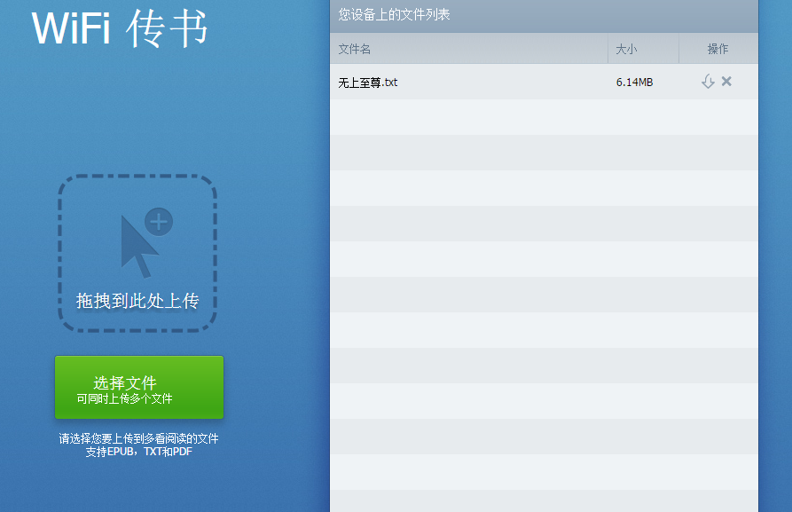

# WIFI传书

参照《多看》的WIFI传书功能
 * 手机端的HttpServer采用开源项目[AndroidAsync](https://github.com/koush/AndroidAsync)实现的。
 * 网页端采用jQuery实现，文件上传采用[Upload5](https://github.com/looptribe/upload5)（HTML5浏览器）和ajaxupload.js(非HTML5浏览器，如IE7/IE8/IE9)

## 手机端截图


## 网页版截图

## AndroidAsync HttpServer技术要点
[AndroidAsync](https://github.com/koush/AndroidAsync)针对HTTP Servers模块的文档介绍非常少，需要大家自己去看源码。本项目中HTTP server功能都在[WebService.java](./app/src/main/java/com/baidusoso/wifitransfer/WebService.java)这个文件中。下面简单说一下本项目中用到一些传输API:
 * 获取x-www-form-urlencoded请求体
```java
UrlEncodedFormBody body = (UrlEncodedFormBody) request.getBody();
``` 
 * 获取multipart/form-data请求体
```java
MultipartFormDataBody body = (MultipartFormDataBody) request.getBody()
``` 
 * 发送文本
```java
response.send("Hello world!");
```
 * 发送文件流
```java
BufferedInputStream bInputStream = ...
response.sendStream(bInputStream, bInputStream.available());
response.sendFile(...);
```
 * 发送Json
```java
response.send(new JSONObject());
```
 * 发送Header
```java
response.getHeaders().add("Content-Disposition", "attachment;filename=" + URLEncoder.encode(file.getName(), "utf-8"));
```
 * 发送特定的响应码
```java
response.code(500);//这个一定要和send()或者end()一起使用
```
## WIFI传输 HttpServer文件上传功能实现
```java
server.post("/files", (AsyncHttpServerRequest request, AsyncHttpServerResponse response) -> {
                    final MultipartFormDataBody body = (MultipartFormDataBody) request.getBody();
                    body.setMultipartCallback((Part part) -> {
                        if (part.isFile()) {
                            body.setDataCallback(new DataCallback() {
                                @Override
                                public void onDataAvailable(DataEmitter emitter, ByteBufferList bb) {
                                    fileUploadHolder.write(bb.getAllByteArray());
                                    bb.recycle();
                                }
                            });
                        } else {
                            if (body.getDataCallback() == null) {
                                body.setDataCallback(new DataCallback() {
                                    @Override
                                    public void onDataAvailable(DataEmitter emitter, ByteBufferList bb) {
                                        try {
                                            String fileName = URLDecoder.decode(new String(bb.getAllByteArray()), "UTF-8");
                                            fileUploadHolder.setFileName(fileName);
                                        } catch (UnsupportedEncodingException e) {
                                            e.printStackTrace();
                                        }
                                        bb.recycle();
                                    }
                                });
                            }
                        }
                    });
                    request.setEndCallback((Exception e) -> {
                        fileUploadHolder.reset();
                        response.end();
                        RxBus.get().post(Constants.RxBusEventType.LOAD_BOOK_LIST, 0);
                    });
                }
        );
```
